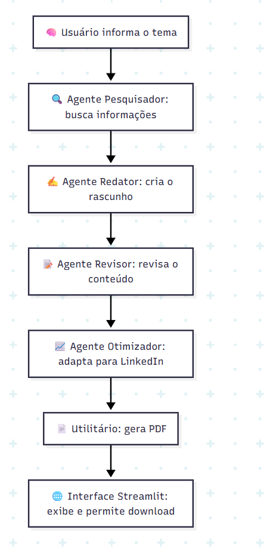
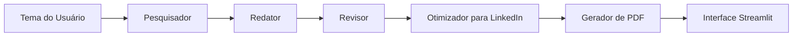

# 🤖 Criador de Posts para LinkedIn com IA

Este projeto foi criado com o objetivo de **gerar automaticamente postagens otimizadas para o LinkedIn** utilizando múltiplos agentes de inteligência artificial. Ele faz uso de **CrewAI** para orquestração de agentes, **Groq** como provedor LLM gratuito, e uma interface web simples com **Streamlit**.

---


---

## 📌 Finalidade

Automatizar a geração de conteúdo profissional (como posts para o LinkedIn) a partir de um **tema sugerido pelo usuário**, passando por etapas de:

1. Pesquisa do tema
2. Escrita do rascunho
3. Revisão do conteúdo
4. Otimização para o estilo do LinkedIn
5. Exportação final em PDF

---

## ⚙️ Tecnologias e Bibliotecas

- 🧠 [CrewAI](https://github.com/joaomdmoura/crewai): orquestração de múltiplos agentes colaborativos
- ⚡ [Groq](https://console.groq.com/): provedor de LLM gratuito (usando modelos como Mixtral ou LLaMA3)
- 🌐 [Streamlit](https://streamlit.io/): interface web simples e rápida
- 📄 [ReportLab](https://www.reportlab.com/): geração de PDFs
- 🔐 [python-dotenv](https://pypi.org/project/python-dotenv/): gerenciamento de variáveis de ambiente

---

## 📁 Estrutura do Projeto

```
criador_posts_linkedin/
├── agentes/
│   ├── pesquisador.py               # Busca informações sobre o tema
│   ├── redator.py                   # Escreve o post inicial
│   ├── revisor.py                   # Revisa ortografia e clareza
│   └── otimizador_linkedin.py       # Ajusta o tom para LinkedIn
├── utilitarios/
│   └── gerador_pdf.py               # Gera PDF do post final
├── interface/
│   └── app_streamlit.py             # Interface gráfica com Streamlit
├── fluxo_agentes.py                 # Orquestração geral dos agentes
├── .env                             # Contém chave da API Groq
├── requirements.txt                 # Dependências do projeto
└── README.md                        # Este arquivo
```

---

## 📊 Diagrama do Fluxo



---

## 🚀 Instalação e Execução

### 1. Clone ou extraia o projeto

```bash
unzip criador_posts_linkedin.zip
cd criador_posts_linkedin
```

### 2. Crie e ative um ambiente virtual (opcional)

```bash
python3 -m venv venv
source venv/bin/activate
```

### 3. Instale as dependências

```bash
pip install -r requirements.txt
```

### 4. Configure a chave da Groq

Edite o arquivo `.env`:

```
GROQ_API_KEY=sua_chave_groq_aqui
LLM_MODEL=mixtral-8x7b
```

### 5. Execute a interface web

```bash
streamlit run interface/app_streamlit.py
```

---

## 📝 Exemplo de Uso

- Digite um tema como: `Tendências de IA em 2025`
- O sistema irá:
  - Buscar contexto
  - Criar um post
  - Revisá-lo
  - Otimizar para LinkedIn
  - Exibir o resultado
  - Permitir download em PDF

---

## 📌 Observações

- O projeto é modular: você pode customizar cada agente facilmente.
- O uso da API da **Groq** é gratuito, basta criar uma conta e obter sua chave.

---

## 📫 Contribuições

Ideias, melhorias e colaborações são bem-vindas! Entre em contato.

---

## 🧑‍💻 Autor

Projeto gerado com suporte da IA [ChatGPT](https://openai.com/chatgpt) + Groq + Streamlit + CrewAI.
